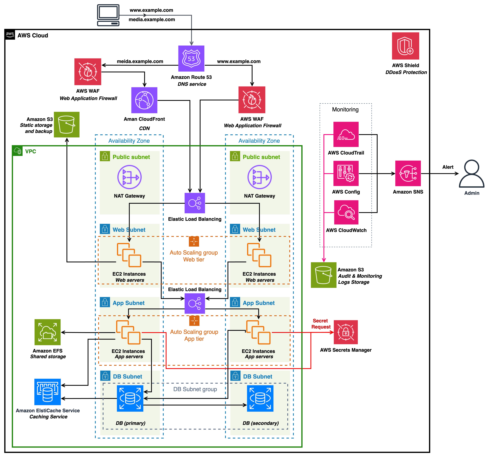

# 🛠️ Terraform - AWS 인프라 구성

**보안 점검 자동화 시스템의 검증을 위한 AWS 인프라 구축**

**안전한 환경과 취약한 환경**을 비교/분석하기 위해, **메인 아키텍처 1종**, **서브 아키텍처 4종**을 각각 안전/취약 상태로 설계


## 📁 디렉토리 구성

```bash
/terraform
├── safe/              # 안전한 환경
    ├── main_safe
    ├── sub1_safe
    ├── sub2_safe
    ├── sub3_safe
    └── sub4_safe
└── vuln/               # 취약한 환경
    ├── main_vuln
    ├── sub1_vuln
    ├── sub2_vuln
    ├── sub3_vuln
    └── sub4_vuln
```
---


## 🌐 아키텍처
> 각 아키텍처는 안전(safe/)과 취약(vuln/) 두 가지 버전으로 존재
### ✅ 메인 아키텍처 (main_safe, main_vuln)
실제 서비스 환경을 모델링한 구성


Route53, CloudFront, WAF, AWS Shield, VPC, Subnet, ALB, S3, EC2(Web/App), EFS, RDS, ElastiCache, Backup, SNS, CloudTrail, Config, CloudWatch, Secret Manager 등 포함

Terraform의 user_data 스크립트를 활용한 [어플리케이션](https://github.com/WHS3-CloudGuardians/CloudGuardian-App) 자동 배포

</br>


### 🧩 서브 아키텍처 
다양한 서비스 조합을 테스트하기 위한 구성

| 아키텍처  | 포함 서비스                          |
|----------|--------------------------------------|
| sub_1 | Cognito, Lambda, EventBridge, API gateway, SQS, Dynamodb, SNS, VPC, WAF, step functions, CloudWatch 등        |
| sub_2   | VPC, Subnet, IAM, EC2, Auto Scaling, ALB, RDS, Elasticache, CloudWatch, S3, Cloudtrail, WAF 등           |
| sub_3 | MSK Cluster, Kafka, Lambda, Event Source Mapping, IAM, CloudWatch, VPC, S3 등   |
| sub_4    | KMS, ECR, Redshift, Athena, SecurityHub, Backup Vault, Glue, CodeBuild, SSM 등            |
---


## ⚙️ 사용 방법
### 🔐 사전 준비 사항
- Terraform 설치 (v1.3 이상 권장)
- AWS CLI 인증 (aws configure)
- 인프라 생성에 필요한 IAM 권한 확보


```bash
# 디렉토리 이동
cd safe/main_safe  # 또는 다른 아키텍처 디렉토리

# 초기화
terraform init

# 계획 확인
terraform plan

# 배포
terraform apply

# 사용 후 리소스 정리
terraform destroy
```


---

> 📎 **참고사항**
>
> 본 구성은 **`ap-northeast-2 (서울)` 리전**을 기준으로 설계되었습니다.  
> 실습 및 테스트 용도로 설계되었지만, 일부 리소스는 **과금**이 발생할 수 있습니다.  
> **배포 완료 후에는 반드시 `terraform destroy` 명령어로 리소스를 정리**하는 것을 권장합니다.


